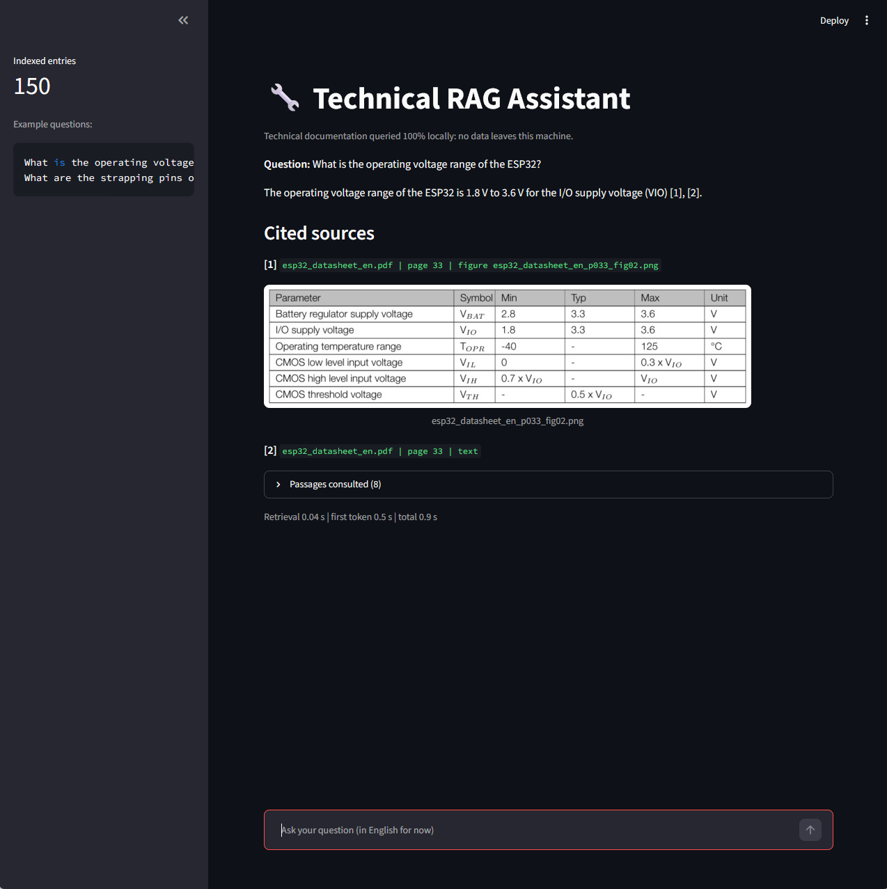
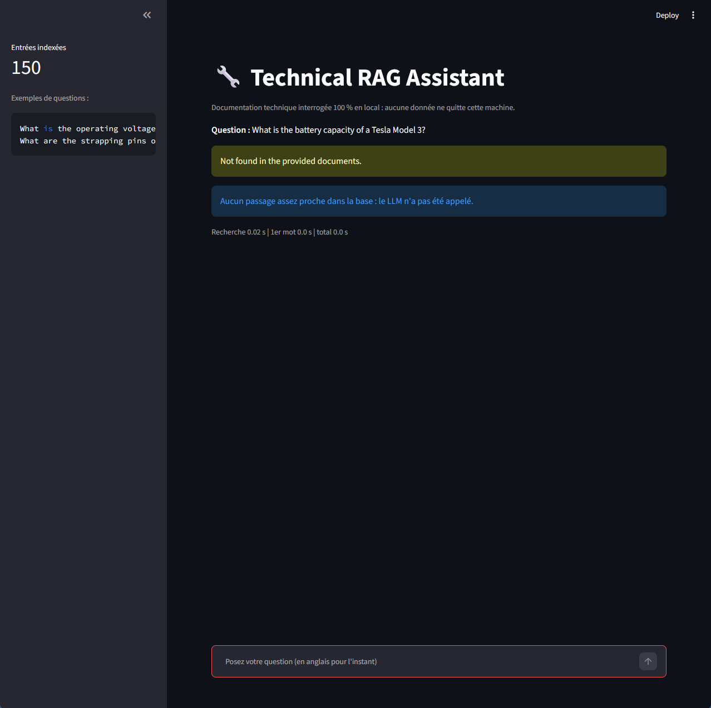

# Technical RAG Assistant

An **offline, multimodal RAG assistant** for hardware and embedded engineers.
Ask questions about datasheets (text **and** figures such as pinouts and tables) and get answers
with the exact **file, page and figure name** as sources. Everything runs locally:
no cloud API, no API key, no document leaves the machine.

> Status: early version. Command-line and Streamlit interfaces work; a first benchmark is included.




## Why

Datasheets are proprietary and long. A cloud chatbot means uploading confidential documents,
and an ungrounded LLM invents pin numbers. This project keeps data local and makes every answer traceable.

Telemetry is disabled in ChromaDB and Streamlit. Internet is used only to download the models once.

## How it works

```
PDF -> text per page + figures (raster and vector) -> chunks with metadata
    -> local embeddings -> ChromaDB
Question -> embedding -> top-K passages -> local LLM -> answer with [n] citations
```

- **Extraction**: PyMuPDF reads text page by page. Vector drawings (pinouts, block diagrams) are
  detected by clustering and rendered to PNG. The native text inside each figure is kept.
- **Figures**: a local VLM (Moondream via Ollama) adds a short description. On the ESP32 datasheet,
  19 of 29 figures received a non-empty description; the others are indexed through their native
  text only. Page title and native labels are indexed with it, because a small VLM reads fine
  details poorly.
- **Retrieval**: `sentence-transformers/all-MiniLM-L6-v2` embeddings and ChromaDB.
- **Generation**: `llama3.2:3b` via Ollama, with a constrained prompt (temperature 0).
- **Traceability**: the LLM only picks source numbers. File, page and figure name are read from
  metadata by the code, so a page number cannot be invented. The model can still cite the wrong
  passage, which is why the grounding check below exists.

## Anti-hallucination safeguards

1. Distance threshold: if no passage is close enough, the LLM is not called.
2. Strict prompt with a fixed refusal sentence.
3. Citations resolved from metadata, not written by the LLM.
4. Grounding check: pin names, values with units and signal names in the answer must appear in
   the cited sources, otherwise a warning is displayed.

## Quick start (Windows, PowerShell)

Requires Python 3.11 or 3.12 (tested on 3.11.3) and [Ollama](https://ollama.com/download).

```powershell
python -m venv venv
venv\Scripts\Activate.ps1
pip install -r requirements.txt

ollama pull moondream
ollama pull llama3.2:3b

# put a PDF in data\raw_pdfs\, then:
python -m src.ingest

# ask questions in the terminal...
python -m src.cli

# ...or in the web interface
streamlit run src/app_streamlit.py
```

Internet is needed only once, to download the models.

## Benchmark

13 questions on one datasheet (ESP32, 43 pages), each asked 3 times. Model `llama3.2:3b`,
top-K 8, distance threshold 1.25, run on 2026-10-04. Expected answers were written by reading the PDF.
13 questions is a small sample: read these numbers as indicative, not as general accuracy.
The benchmark checks that expected values appear in the answer, not that they are attached to the right signal.

### Results per question

| Outcome | Questions |
|---|---|
| Correct answer (or correct refusal), right page | 8 of 13 |
| Correct answer, wrong page cited (flagged by the grounding check) | 1 of 13 (Q07) |
| Wrong answer with no warning | 2 of 13 (Q01, Q11) |
| Wrong answer with a warning displayed | 1 of 13 (Q13) |
| Refusal although the answer existed | 1 of 13 (Q03) |

Q11 gave a wrong answer in 2 runs out of 3 and a refusal in the third.

### Results per run (39 runs)

| Metric | Result |
|---|---|
| Correct answers or correct refusals | 69 % (27/39) |
| Fully correct (answer and cited page, or correct refusal) | 62 % (24/39) |
| Silent errors (wrong, no warning) | 13 % (5/39) |
| Flagged errors (wrong, warning shown) | 8 % (3/39) |
| Useless refusals (answer existed) | 10 % (4/39) |
| Questions whose verdict changed between runs | 1/13 (Q11) |
| Median / max total latency, model already loaded | 0.3 s / 1.5 s |
| Median retrieval | 10 ms |

Latencies were measured with the model already in memory; a cold start took about 38 s.
A first single-run pass gave a 0.6 s median and a 1.3 s maximum.

### What the benchmark showed

- **Retrieval limits some answers more than generation.** For Q03 (SPICLK, SPID, SPIQ), the pin table
  on pages 14-15 never reached the LLM: page 14 is absent from the 12 nearest entries and page 15
  ranks 8th at a distance of 1.34, above the 1.25 threshold. The embedding model handles
  identifiers like `SPICLK` poorly.
- **Dimensions drawn in a raster figure are not readable.** For Q11 (package dimensions), the model
  answered a value that does not appear in the drawing, with no warning. The check
  cannot compare against text that does not exist, and it does not cover the `mm` unit.
- **Incomplete answers pass the check.** Q01 returned the I/O supply range as the supply range.
  The check detects values absent from the sources, not omissions.
- **The grounding check catches wrong citations.** On Q07 the answer was right but cited the wrong page,
  and the check flagged it.
- **Figure layout is lost.** For Q13 (blocks inside the RTC block of the block diagram), both models
  answered wrongly. A likely cause, not verified: the native text of a vector figure keeps the labels
  but not which box contains which, and the small VLM adds nothing on this figure.
- **No benchmark question yet shows a correct answer that depends on a drawing.** Q12 was answered
  from the page text, not from the figure. Figures are indexed and cited (see the screenshot above),
  but answering from a drawing is not demonstrated.

### Model comparison (same 13 questions, 3 runs each)

| | llama3.2:3b | mistral (7B) |
|---|---|---|
| Correct answers or refusals (questions) | 9/13 | 9/13 |
| Fully correct, answer and page (questions) | 8/13 | 8/13 |
| Wrong answer, no warning | Q01, Q11 (2 runs of 3) | Q01, Q13 |
| Wrong answer, warning displayed | Q13 | Q03 |
| Refusal although the answer existed | Q03 (and Q11 once) | Q11 |
| Median / max total latency, model loaded | 0.3 s / 1.5 s | 0.7 s / 2.8 s |

The larger model was about twice as slow and not more accurate on this set. With 13 questions,
a one-question difference is not significant. The same questions fail with both models.

## Known limitations

- Small models read dense tables poorly, and the embedding model retrieves identifiers poorly (see Q03).
- The grounding check is lexical: it catches invented values and names, not real values attached to the wrong signal, not omissions, and not units outside its list.
- Values that appear only inside raster images depend on a small VLM and are not verified.
- Page numbers are those of the PDF reader, which can differ from the printed page numbers.
- The embedding model is English-oriented, so questions should be in English for now.
- Tested on a single datasheet and 13 questions. Q11 to Q13 were added after seeing the system's behavior on the first ten.

## Roadmap

- Keyword search (BM25) alongside embeddings, for identifiers such as `SPICLK`
- Add the `mm` unit to the grounding check and report before/after on the benchmark
- Larger benchmark, on several datasheets